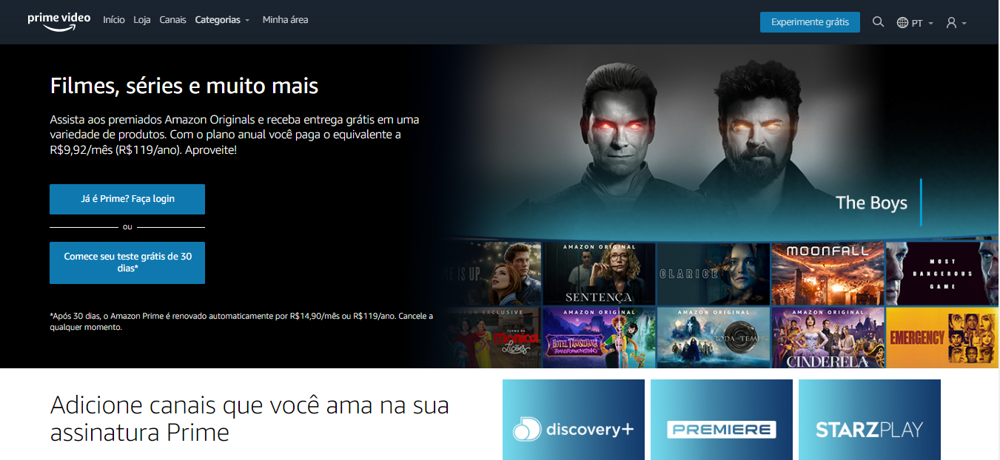

## Amazon Clone Video
<h4 align="center">
  Clone do site Amazon Prime Video, para fins de aprendizagem! 
</h4>



## Tecnologias

Este projeto foi desenvolido utilizando tecnologias Front-End de ponta. <br>

- [HTML](https://www.w3schools.com/html/)
- [CSS](https://www.w3schools.com/css/)
- [JavaScript](https://www.javascript.com/)
- [Typescript](https://www.typescriptlang.org/)

## 💻 Getting started

### Requerimentos

**Clone este projeto e acesse a pasta:**

```bash
$ git clone https://github.com/Guylhermee/podcastr.git && cd Amazon-Clone-Video
```

O aplicativo estará disponível para acesso no navegador ao abrir o arquivo `index.html`

## 📝 Licença

This project is licensed under the MIT License - see the [LICENSE](LICENSE) file for details.

---

Projeto acadêmico feito por Guilherme Barbosa Pereira para fins de aprendizagem.
